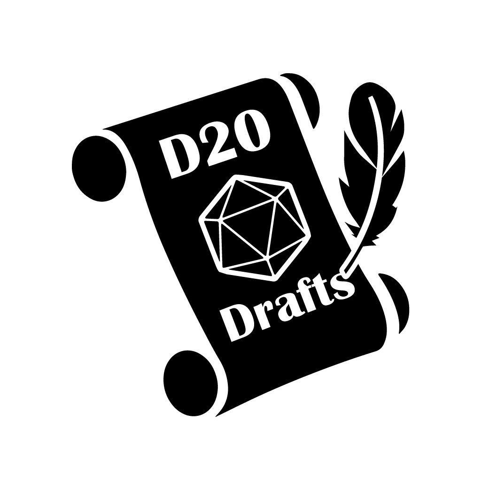

# D20 Drafts
An choose your own adventure Discord bot with a 20 sided Dice!

## Table of Contents  
- [Install](#Install)  
- [Config](#config)  
- [Terminal Commands](#Terminal-Commands)  
- [Discord Commands](#Discord-Commands)  
  - [Start](#Start)
  - [Remove](#Remove)
  - [Reload](#Reload)
  - [Pause](#Pause)
  - [Stats](#Stats)

---

## Install

Clone the project in the terminal.

```
git clone https://github.com/peltos/d20-drafts.git
```

Go to the directory.

```
cd d20-drafts
```

Install all the packages.

```
npm install
```

Duplicate the `.env.example` file and rename it to `.env`. Open the file and change the `TOKEN` variable with the token of your discord bot. You can find/make your bot here https://discord.com/developers/applications.

Then start the application with

```
npm start
```

---

## Config

The following options are available in the `.env` file,
- `TOKEN` - The discord token that is required to start this application
- `TIME` - The time in miliseconds it takes for people to vote on every plot point. (defaults at 10000 miliseconds / 10 seconds)
- `PREFIX_CHAR` - Prefix character that is used as the start of the command (default on exclamation mark "!")
- `PREFIX_WORD` - The word that comes after the PREFIX_CHAR. (default on "d20d")

---

## Terminal Commands
These are all the commands you can do in the terminal
- `npm start` - to start the application
- `npm run lint` - to activate the ESLint library

---

## Discord Commands
These are all the commands used for all your adventures in discord

---

## Start

To start your story you only have to insert this command

```
!d20d start [storyId] [settings]
```
This command needs two things

- `storyId` (required) The story you want to play
- `settings` (optional) Changes the variables within the story. See all settings in the table below.

<table>
    <thead>
        <tr>
            <th colspan=2>Settings</th>
        </tr>
    </thead>
    <tbody>
        <tr>
            <td>hp:[number]</td>
            <td>Set hitpoints (default hp is in the story)</td>
        </tr>
        <tr>
            <td>plotpoint:[number]</td>
            <td>Set where to begin within the story</td>
        </tr>
        <tr>
            <td>time:[number]</td>
            <td>Set the time between each choice</td>
        </tr>
    </tbody>
</table>
<br>

The `storyId` is needed to choose your story. The `plotPointId` is an optional addition to go directly to a certain plot point.

Example (default):  
```
!d20d start example
```

Example (going to a specific Plot Point):  
```
!d20d start example plotpoint:2
```

Example (going to a specific Plot Point with different Hitpoints):  
```
!d20d start example plotpoint:2 hp:24
```

Short command:  
```
!d20d s example
```

---

## Remove

To remove your story you only need to enter this command in the channel where the story is activated.

```
!d20d remove
```
It will give a message that it stopped.

Short command:  
```
!d20d rem
```

---

## Reload

When the bot has been (abruptly) stopped, the reload command can restart the story. If this happens, the story will resume at the plot point the bot was previously on. A new delay will be set at that point. It needs to be used in the same channel that was used before.

```
!d20d reload
```

Short command:  
```
!d20d rel
```

---

## Pause

You can pause the story whenever the story is active. The next time the story is reloaded it will start at the current plot point with a new delay set.

```
!d20d pause
```

Short command:  
```
!d20d p
```

---

## Stats

This will show the current stats of the story and character.

```
!d20d stats
```